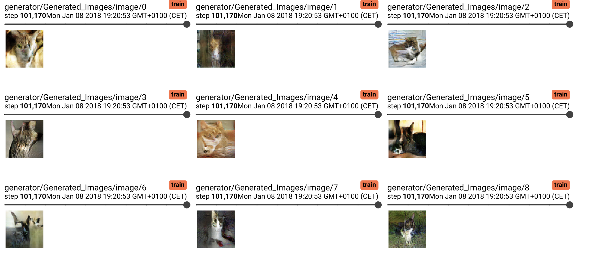
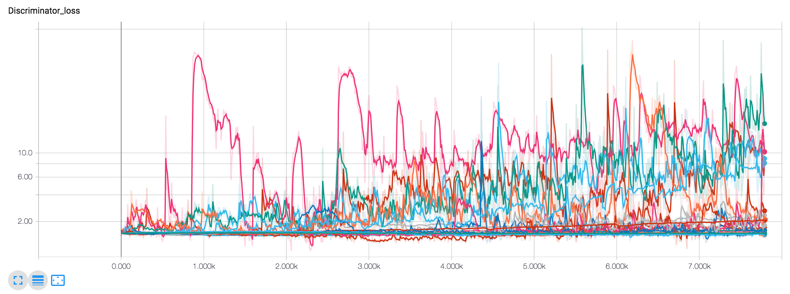
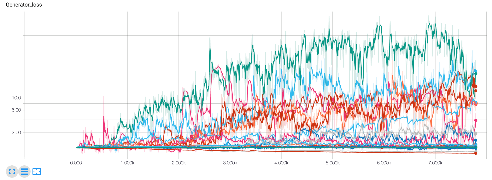
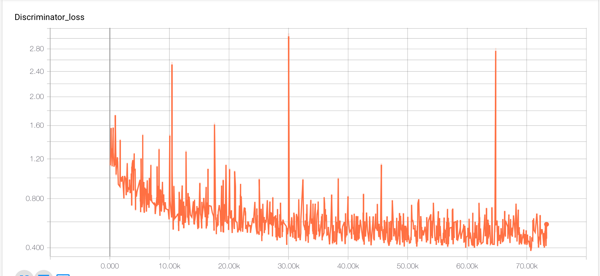
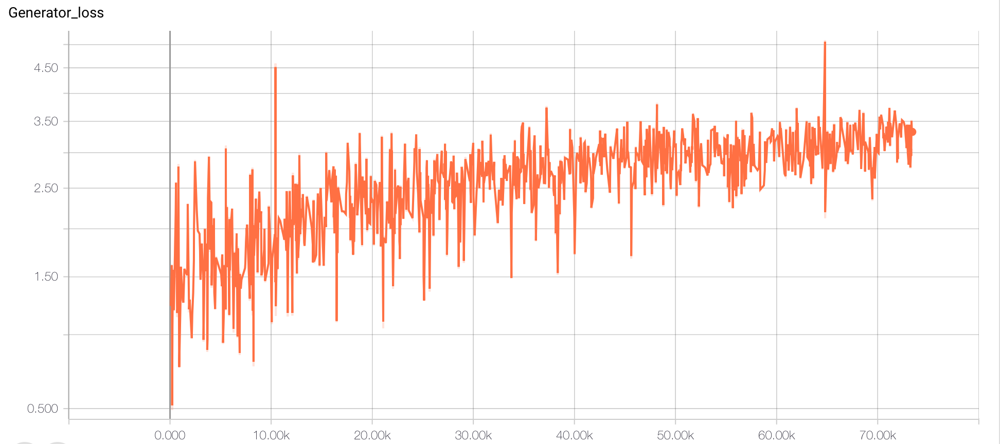

# DCGAN
Deep Convolutional Generative Adversarial Network[1]

Generating cat images with DCGANS on hops.site because who doens't love cats?
Showing results from running a while on a gpu before computaional budget expired.

The architecture had to be adjusted a little bit to get any learning signal...

## Results

## Training Curves

## Requirements 

* [Tensorflow 0.12.1](https://github.com/tensorflow/tensorflow/tree/r0.12)

## Usage

> python train.py

or simply run the jupyter notebook...

## Disclaimer

Old project from 2017 or something... 
code quaility is shit

## References

[1] https://arxiv.org/pdf/1511.06434.pdf
